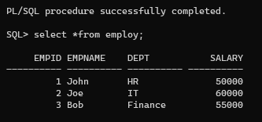

# Ex. No: 4 Creating Procedures using PL/SQL
### DATE:
## Aim: 
To create a procedure using PL/SQL.

## Algorithm:
1. Create a table to store employee information, like their ID, name, department, and salary.
2. Make a procedure called "insert_employ_data."
3. Inside the procedure:
* Add details of three employees to the table, like their ID, name, department, and salary.
* Save these changes.
* Show all the employee details one by one.
4. Run the "insert_employ_data" procedure to add employees and show their info.
5. Lastly, check and display all the employee records in the table to see the updated data.

>This algorithm sets up a table, puts data into it, defines a process to do this, runs that process, and shows the results.
```
DEVELOPED BY : SUBRAMANIYA PILLAI B
REG NO : 212221230109
```
## Program:
```sql
create table employ( empid number,empname varchar(10),dept varchar(10),salary number);

CREATE OR REPLACE PROCEDURE insert_employ_data AS
BEGIN

INSERT INTO employ (empid,empname,dept,salary) VALUES (1,'John','HR',50000);

INSERT INTO employ (empid,empname,dept,salary) VALUES (2,'Joe','IT',60000);

INSERT INTO employ (empid,empname,dept,salary) VALUES (3,'Bob','Finance',55000);

COMMIT;

FOR emp_rec IN (SELECT * FROM employ) LOOP
DBMS_OUTPUT.PUT_LINE('Employee ID: ' || emp_rec.empid || ',Employee Name: ' || emp_rec.empname || ', Department: ' || emp_rec.dept || ', Salary:' || emp_rec.salary);
END LOOP;
END;
/
BEGIN
    insert_employ_data;
    END;
    /
select *from employ;
```
## Output:

## Result:
   Thus, procedure is created using PL/SQL.
